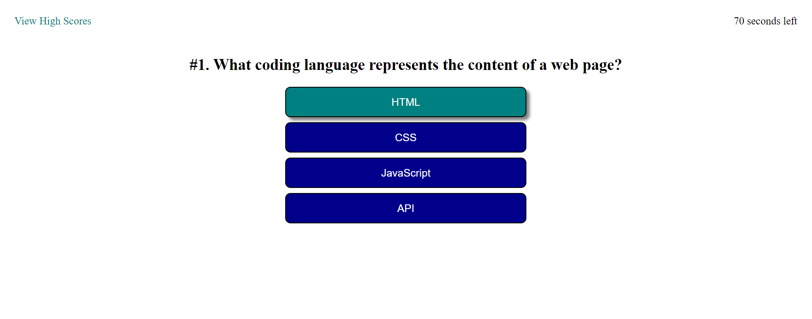

# Coding Quiz

## About

This program is a coding quiz that utilizes JavaScript to switch between questions, store data, and display previous scores on the page! This project is great to test out knowledge on basic coding concepts from HTML, CSS, and JavaScript and compete against others for a high score. From doing this, users can both review and learn things from the questions and test out their coding knowledge.

The page starts off with instructions on how to play and a large Start button that is clickable. Once the Start button has been pressed, the questions will start appearing and the timer will start counting down. Players will have 75 seconds to answer as many questions as possible.

At the top left corner, there is a link to view all high scores currently logged. When the cursor hovers over the link, a box appears showing the high scores. (The picture has no data logged, so nobody appears.)

Each question has four multiple choice options and users need to choose the correct answer. All of the questions are about HTML, CSS or JavaScript. To make it more intuitive, the boxes change color when the user hovers over them so they know which answer they are choosing. If the answer chosen is correct, a point is added to their total score. If the answer chosen is wrong, 10 seconds is deducted from the timer. There will also be a brief message on the bottom telling the user if their answer was right or wrong that appears for about 2 seconds.

When all questions have been answered or time runs out, the program will tell the user how many questions they've answered correctly. They then can add their initials and submit their score to the score leaderboard to compare with others who have played. If the user did not enter their initials, the form will produce an error until something has been entered.

The user can now see their score and compare it to others who have played. They then have the option to go back to the starting page and try again, or clear the board of all scores for a blank list.

## Links

GitHub Repository Link: https://github.com/cindyung56/coding-quiz

Link to Page: https://cindyung56.github.io/coding-quiz/
